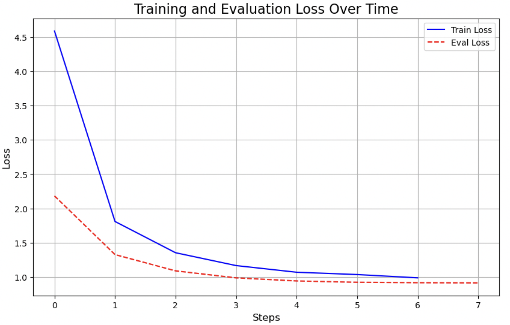
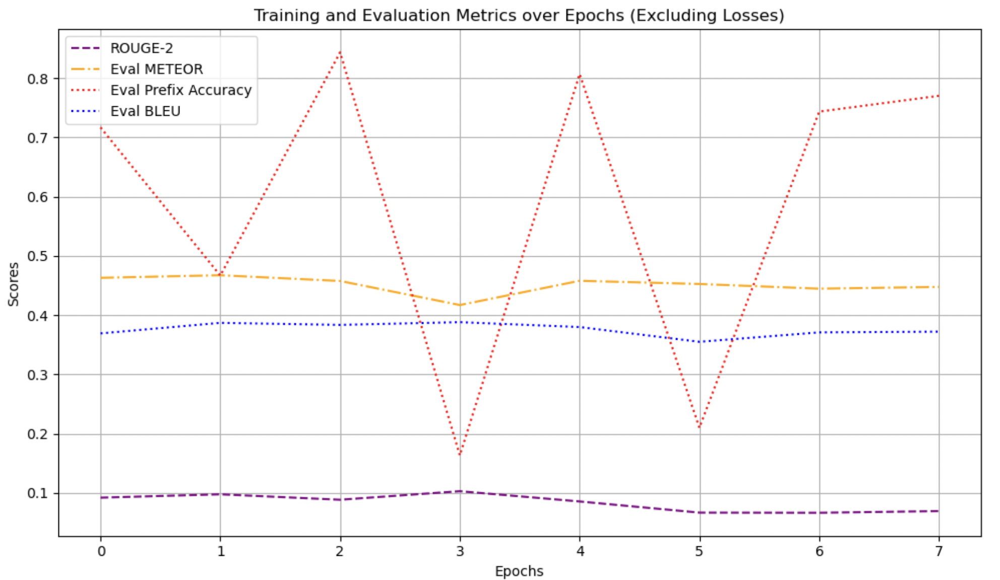

# Fine-Tuning-Codet5-Model-For-Automatic-Commit-Message-Generation

This notebook demonstrates the fine-tuning of the **CodeT5-small** model for generating commit messages from commit diffs. The project includes synthetic data generation, model training, and evaluation with metrics like BLEU, ROUGE, and METEOR.

 *(Example training/evaluation loss curve)*

 *(Example metrics evaluation)*

## Key Features

- **Synthetic Dataset Generation**: Creates realistic commit messages/diffs for training
- **CodeT5-small Fine-Tuning**: Adapts a code-specific transformer for commit generation
- **Comprehensive Metrics**: Evaluates with BLEU, ROUGE, METEOR, and custom accuracy metrics
- **Training Visualization**: Tracks loss and metrics throughout training

## Notebook Structure

1. **Synthetic Data Generation**
   - Creates 1,500 synthetic commit samples with varied patterns
   - Includes features, fixes, refactors, docs, tests, etc.
   - 80/20 train-validation split

2. **Model Setup**
   - Uses `Salesforce/codet5-small` as base model
   - Configures seq2seq training with custom tokenization

3. **Training Configuration**
   - 10 epochs with batch size 8
   - Learning rate 2e-5 with warmup
   - Gradient accumulation (steps=2)
   - CPU training (can be modified for GPU)

4. **Evaluation**
   - Custom metrics callback
   - Loss and metric tracking
   - Final benchmark results

5. **Analysis**
   - Training/evaluation loss curves
   - Metric trends (BLEU, ROUGE, METEOR)
   - Performance interpretation

## Requirements

- Python 3.7+
- Key packages:
  - transformers
  - datasets
  - evaluate
  - numpy/matplotlib
  - torch
  - faker

## Usage

1. Run cells sequentially in the notebook
2. Training takes ~2 hours on CPU (adjust epochs/batch size as needed)
3. Monitor progress via printed metrics
4. Final model saves to `./commit-gen-2`

## Results

On synthetic data (see limitations):
- Final BLEU: ~0.39
- METEOR: ~0.47
- ROUGE-L: ~0.30
- Prefix Accuracy: ~0.85

## Attached Paper

A short accompanying paper discusses:
- The CodeT5 architecture
- Commit message generation challenges
- Synthetic data methodology
- Results analysis

*Note: Some harmless exceptions may appear during training - these don't affect model functionality and can be ignored.*

## Limitations

1. **Synthetic Data**: Model trained on artificial examples only
2. **Small Scale**: 1,500 samples may limit generalization
3. **Compute**: CPU-only training in current configuration

## Future Work

- Train on real commit datasets
- Experiment with larger CodeT5 variants
- Add beam search during generation
- Deploy as Git hook/CLI tool
